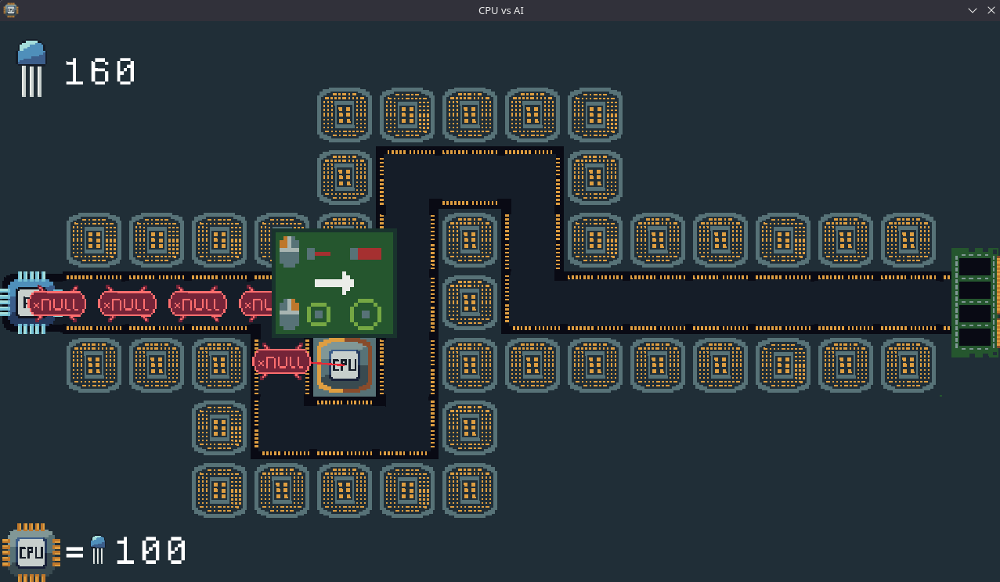

The AI chip on your motherboard lost control! the code it's generating is full of bugs!  
Place and upgrade your CPUs to destroy these bugs!  
Don't let the bugs get across the PCIE lanes and corrupt your RAM!

We managed to get this game into a MVP state 17 hours before the deadline.  
Repository state at time of [submission](https://discord.com/channels/551921866173054977/1398343424104468622/1399153592434167869): [here](https://github.com/The-Memory-Managers/cpu-vs-ai/tree/4f5a466025ca3aa5b3e5426397922253d86a8fb6)

Watch a video playthrough: [youtu.be/\_clLDGNlef0](https://youtu.be/_clLDGNlef0)

[](https://youtu.be/_clLDGNlef0)

## Installation

Clone the repository:

```
git clone https://github.com/The-Memory-Managers/cpu-vs-ai
cd hackathon
```

Install zig release version 0.14 from https://ziglang.org/download/

Then run:

```
zig build run
```

If you are on NixOS, run `nix develop` and then inside it run `zig build run`

Contact us if you have issues building the game, we will try to help you out.

## How to play

Left click to place a CPU where a socket is available.

CPUs get upgraded based on how many bugs they destroyed.

An upgraded CPU will show a popup:

- Left click to upgrade bus width (more damage)
- Right click to upgrade cache size (further range)

The amount of CPU cores determine how many bugs it can attack in parallel.

### Tips if you struggle beating a level (spoiler)

- Try positioning your CPUs differently, where they can control the most lanes
- Try experimenting with different bus widths and cache sizes
- If you still can't beat a level, you can skip it by pressing the "s" key

### There is an easteregg, let us know if you found it!

## Credits

- **Code (src/\*)**  
  Copyright (c) 2025 Kyren223, Nuclear Pasta, and GottZ. All rights reserved.

- **Art (assets/img/\*)**  
  Copyright (c) 2025 Kyren223. All rights reserved.

- **Audio (assets/sfx/\*)**  
  Sound effects and music are public domain, sourced from [freesound.org](https://freesound.org).

- **Fonts (assets/font/\*)**  
  Fonts are sourced from [nerdfonts.com](https://www.nerdfonts.com).


- **[raylib-zig](https://github.com/Not-Nik/raylib-zig)**  
  MIT License, Copyright (c) 2020 Nikolas Wipper


- **[raylib](https://github.com/raysan5/raylib)**  
  Zlib License, Copyright (c) 2013-2025 Ramon Santamaria (@raysan5)

